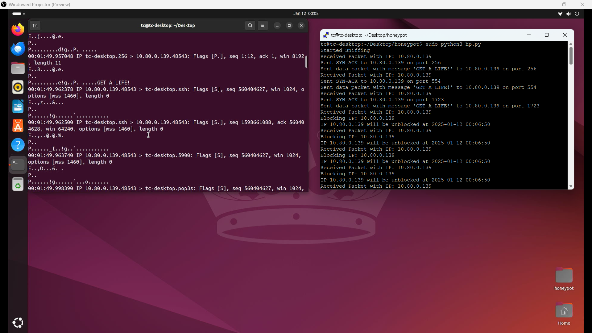
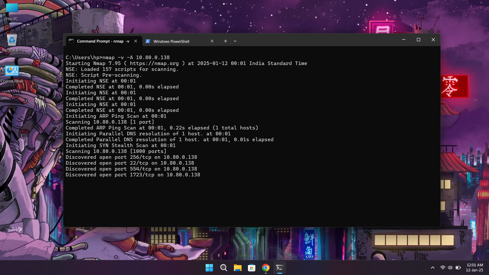

# Port Scan Honeyport

This project is a port-scanning honeypot designed to detect and block malicious traffic using Python, Scapy, and iptables. It tracks repeated SYN packets from the same IP address, blocks the offending IP if it exceeds a defined threshold, and taunts the attacker with a custom message. The script is designed to run on Linux systems and is ideal for lightweight devices like the Raspberry Pi.

---

## Features

1. **Packet Sniffing**: Monitors incoming TCP packets and identifies SYN packets.
2. **IP Blocking**: Dynamically blocks IP addresses that exceed a specified threshold of SYN packets.
3. **Auto Unblocking**: Automatically unblocks IPs after a configurable timeout period.
4. **Attacker Engagement**: Sends a taunting message ("GET A LIFE!") to attackers via a TCP payload.
5. **Lightweight**: Optimized for Raspberry Pi (tested on Raspberry Pi 8GB Model B).

---

## Screenshots

### 1. Terminal Output
The script detects and blocks malicious IPs.



### 2. Attacker Output
NMAP Scan from attacker side:



---

## Requirements

- **Hardware**: Raspberry Pi 8GB Model B or any Linux system.
- **Operating System**: Ubuntu or any Debian-based distribution.
- **Python**: Python 3.6+
- **Dependencies**:
  - `scapy`
  - `subprocess`
  - `datetime`
  - `collections`
  - `threading`

---

## Installation

### 1. Install Python Dependencies

```bash
sudo apt update
sudo apt install python3 python3-pip iptables -y
pip3 install scapy
```

### 2. Clone the Repository

```bash
git clone <repository_url>
cd <repository_directory>
```

### 3. Run the Script

```bash
sudo python3 honeypot.py
```

> **Note**: Root privileges are required to modify iptables and sniff packets.

---

## Configuration

The following parameters can be configured in the script:

- **`BLOCK_DURATION`**: Time period (in minutes) for which an IP remains blocked. Default: `5` minutes.
- **`MAX_COUNT`**: Maximum number of SYN packets allowed before blocking an IP. Default: `3`.
- **Custom Message**: Modify the taunt message in the `Raw(load="GET A LIFE!")` payload.

---

## How It Works

1. **Packet Monitoring**:
   - Sniffs incoming TCP traffic using Scapy.
   - Filters packets to identify SYN requests.

2. **Tracking and Threshold**:
   - Tracks SYN requests per IP address.
   - Blocks IPs that exceed the defined `MAX_COUNT` within the `BLOCK_DURATION`.

3. **IP Blocking**:
   - Uses `iptables` to drop packets from offending IPs.
   - Automatically unblocks IPs after the `BLOCK_DURATION` expires.

4. **Attacker Engagement**:
   - Sends a SYN-ACK and a taunting message ("GET A LIFE!") to detected attackers.

---

## Deployment

### Running on Raspberry Pi

1. Ensure all dependencies are installed (refer to the **Installation** section).
2. Run the script with root privileges:

   ```bash
   sudo python3 honeypot.py
   ```

3. Monitor the output in the terminal for detected IPs, taunt messages, and block/unblock events.

### Running as a Service

1. Create a systemd service file:

   ```bash
   sudo nano /etc/systemd/system/honeypot.service
   ```

   Add the following content:

   ```ini
   [Unit]
   Description=Port Scan Honeyport
   After=network.target

   [Service]
   ExecStart=/usr/bin/python3 /path/to/honeypot.py
   Restart=always
   User=root

   [Install]
   WantedBy=multi-user.target
   ```

2. Enable and start the service:

   ```bash
   sudo systemctl enable honeypot.service
   sudo systemctl start honeypot.service
   ```

3. Check the service status:

   ```bash
   sudo systemctl status honeypot.service
   ```

---

## Logs

The script currently uses `print` statements for logging. To enable more robust logging:

1. Replace `print` with Python's `logging` module.
2. Direct logs to a file for persistent storage and debugging.

Example:

```python
import logging
logging.basicConfig(filename="honeypot.log", level=logging.INFO, format="%(asctime)s - %(message)s")
```

---

## Security Considerations

1. **IP Whitelisting**:
   - Modify the script to exclude trusted IP ranges from blocking.
2. **Resource Usage**:
   - Periodically clean up old entries in the tracker to avoid memory bloat.
3. **Testing**:
   - Test the honeypot in a controlled environment before deploying it in production.

---

## Contributing

Contributions are welcome! Please follow these steps:

1. Fork the repository.
2. Create a feature branch (`git checkout -b feature-name`).
3. Commit your changes (`git commit -m "Add feature"`).
4. Push to the branch (`git push origin feature-name`).
5. Open a pull request.

---

## Acknowledgments

- **Scapy**: For its powerful packet crafting and sniffing capabilities.
- **Raspberry Pi Community**: For their support and tutorials.

---

## Disclaimer

This script is intended for educational and defensive purposes only. The author is not responsible for any misuse or legal issues arising from its deployment.

